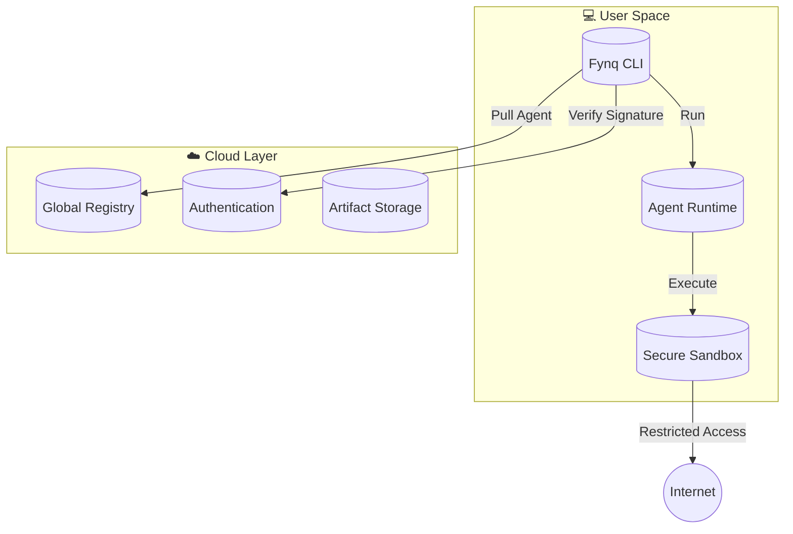

<div align="center">

  <!-- Hero Section -->
  

  <h1 style="font-size: 60px; margin-bottom: 0;">Fynq</h1>
  <p style="font-size: 24px; color: #888;">Orchestrate Intelligence.</p>

  <br />

  <!-- Premium Badges -->
  <a href="https://github.com/AshwinRenjith/fynqADK">
    
  </a>
  <a href="https://pypi.org/project/fynq/">
    
  </a>
  <a href="https://fynq.sh">
    
  </a>

  <br />
  <br />

  <p align="center" style="max-width: 600px; line-height: 1.6;">
    <b>The package manager for the agentic age.</b><br>
    Discover, install, and run autonomous agents with the simplicity of a single command.<br>
    Built for the next generation of AI engineering.
  </p>

  <br />

  <!-- Action Buttons (Simulated) -->
  <code>curl -fsSL https://fynq.sh/install | sh</code>

  <br />
  <br />
  <br />

  <a href="#-features">Features</a> &nbsp;&bull;&nbsp;
  <a href="#-quick-start">Quick Start</a> &nbsp;&bull;&nbsp;
  <a href="#-registry">Registry</a> &nbsp;&bull;&nbsp;
  <a href="#-architecture">Architecture</a>

</div>

<br />
<br />

---

<br />

## ✨ The Fynq Experience

Fynq reimagines how we interact with AI. It is not just a tool; it is a protocol for **autonomous execution**. Just as `npm` unlocked the power of JavaScript modules, **fynq** unlocks the power of composable AI agents.

### Why Fynq?

*   **⚡ Native Performance**: A lightweight CLI written in Python, optimized for speed.
*   **🔒 Secure Sandbox**: Agents run with least-privilege permissions. You decide if they can access the web or your files.
*   **🌍 Universal Registry**: Publish your intelligence once, run it anywhere. Versioned, signed, and immutable.
*   **🔌 Model Agnostic**: Bring your own LLM. Use GPT-4 for reasoning, Haiku for speed, or a local Llama 3 for privacy.

<br />

---

<br />

## 🚀 Quick Start

From zero to autonomous in 10 seconds.

### 1. **The Summoning**
Install the universal runtime.

```bash
curl -fsSL https://fynq.sh/install | sh
```

### 2. **First Contact**
Summon a researcher agent to analyze a topic for you.

```bash
# Analyze a YouTube video and write a report
fynq run @fynq/youtube --task "Analyze the MFE paradigm in https://youtu.be/..." 
```

<br />

---

<br />

## 🛠️ Building Intelligence

Become a creator. Build agents that act on your behalf.

### **1. 🏗️ Initialize**
Create a new workspace with a standardized structure.
```bash
fynq init my-agent
cd my-agent
```

### **2. 🧠 Implement**
Write your agent logic in `main.py`. The `fynq` SDK handles the heavy lifting.
```python
# main.py
import fynq
from fynq import Agent

def main():
    # The runtime injects the user's task automatically
    task = fynq.get_task() 
    
    # Use the 'browser' tool capability
    content = fynq.tools.browser.visit("https://example.com")
    
    # Analyze with the configured LLM
    summary = fynq.llm.chat(f"Summarize this: {content}")
    
    print(summary)
```

### **3. 📦 Publish**
Share your creation with the world.
```bash
fynq publish
# 🚀 Successfully published @your-name/my-agent v0.1.0
```

<br />

---

<br />

## 🏗️ Architecture

The Fynq ecosystem is composed of three harmonious layers.



<br />

---

<br />

## 📦 The Registry

A curated collection of verified agents.

| Package | Description | Version |
| :--- | :--- | :--- |
| **[`@fynq/researcher`](#)** | Deep web researcher. Browses, reads, cites sources. | `v1.2.0` |
| **[`@fynq/coder`](#)** | Full-stack software engineer. Edits files, runs tests. | `v0.8.5` |
| **[`@fynq/youtube`](#)** | Watch & analyze videos. Extracts timestamps & summaries. | `v1.0.1` |
| **[`@fynq/data`](#)** | SQL & CSV analyst. Visualizes data trends. | `v0.9.0` |

<br />

---

<br />

<div align="center">
  <br />
  <h3>Join the Revolution</h3>
  <br />
  <a href="https://twitter.com/fynqai">
    
  </a>
  &nbsp;
  <a href="https://discord.gg/fynq">
    
  </a>

  <br />
  <br />
  <p style="color: #666; font-size: 12px;">
    Crafted with 🖤 by the Fynq Team.<br>
    © 2026 Fynq Inc. All rights reserved.
  </p>
</div>
