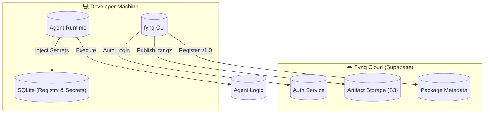

<div align="center">

  <h1>
    <br/>
    ✨ fynq
    <br />
  </h1>
  <sup>The Universal Package Manager for AI Agents</sup>
  <br />
  <br />

  [](https://github.com/AshwinRenjith/fynq)
  [](https://github.com/AshwinRenjith/fynq)
  [](LICENSE)
  [](https://github.com/AshwinRenjith/fynq)

  <br />
  <p align="center">
    <a href="#-installation">Installation</a> •
    <a href="#-quick-start">Quick Start</a> •
    <a href="#-key-features">Features</a> •
    <a href="#-architecture">Architecture</a>
  </p>
  <br />

</div>

---

## 🚀 The Protocol for Agents

**fynq** (/fɪŋk/) is the missing link in the AI Agent ecosystem. It solves the **"It runs on my machine"** problem for autonomous software.

Just as `npm` revolutionized JavaScript and `cargo` empowered Rust, **fynq** provides a unified, hermetic, and secure runtime for AI Agents. It abstracts away the complexity of LLM keys, vector databases, and tool permissions, allowing you to run agents from the cloud with a single command.

<div align="center">
<pre>
<font color="#00f2ff">❯</font> fynq run @ashwin/researcher --task "Analyze Quantum Computing trends"
<font color="#8a2be2">Resolving package...</font> verified
<font color="#8a2be2">Injecting secrets...</font> done
<font color="#00ff00">✔ Agent finished in 4.2s</font>
</pre>
</div>

---

## ⚡ Installation

Install the compiled binary globally (recommended):

```bash
curl -fsSL https://fynq.ai/install.sh | bash
```

Or build from source:

```bash
git clone https://github.com/AshwinRenjith/fynq.git
cd fynq
./build.sh
```

---

## 🏁 Quick Start

### 1. The Magic Loop

Fynq is designed for a seamless lifecycle: **Create → Publish → Run**.

#### **Initialize**
Create a new agent scaffold in seconds.
```bash
fynq init my-agent
cd my-agent
```

#### **Develop**
Write your logic in `main.py` using the `fynq` SDK.
```python
import fynq

def main():
    # The runtime handles the LLM connection (OpenAI, Mistral, Ollama)
    response = fynq.llm.chat("Hello World")
    print(response)
```

#### **Publish**
Push your agent to the Fynq Cloud Registry.
```bash
fynq publish
# 🚀 Published @local/my-agent v0.1.0 to registry
```

#### **Run Anywhere**
Anyone, anywhere can now execute your agent.
```bash
fynq run @local/my-agent
```

---

## 💎 Key Features

| Feature | Description |
| :--- | :--- |
| **📦 Hermetic Runtime** | Agents are isolated. They see *only* the environment variables and tools you explicitly grant. No more `.env` file hell. |
| **🔑 Secret Management** | `fynq config set API_KEY ...` saves keys securely in a local encrypted database. They are injected *just in time* during execution. |
| **☁️ Cloud Registry** | Built on top of **Supabase**, offering instant global distribution, versioning, and dependency resolution. |
| **🧠 Model Agnostic** | Write code once. Run it on **GPT-4**, **Claude**, or local **Llama 3**. The user decides the model, not the code. |
| **🛠️ Tool Protocol** | Standardized interface for File System, Browser, and Terminal access. (Coming Phase 3) |

---

## 🏗️ Architecture

The system is composed of three layers working in harmony.



---

## 🔒 Security

Fynq takes security seriously.
*   **No Arbitrary Execution**: Agents must define `entry_point`.
*   **Sandboxed Environment**: (Roadmap) WebAssembly-based isolation.
*   **Permission Scopes**: Agents must request capabilities (`network`, `fs`) in `agent.yaml`.

---

<div align="center">
  <br />
  <sub>Built with ❤️ by the Fynq Team using <b>Python</b>, <b>Typer</b>, and <b>Supabase</b>.</sub>
  <br />
  <sup>© 2026 Fynq Inc.</sup>
</div>
